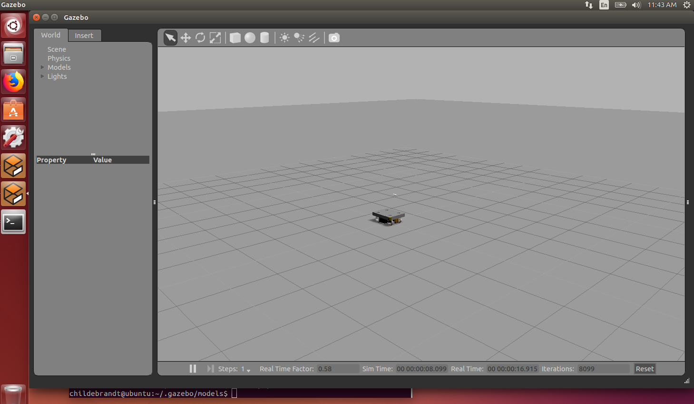
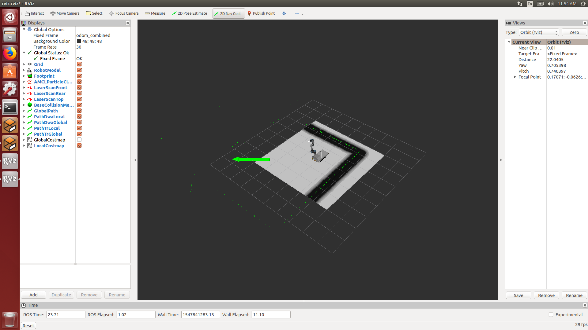
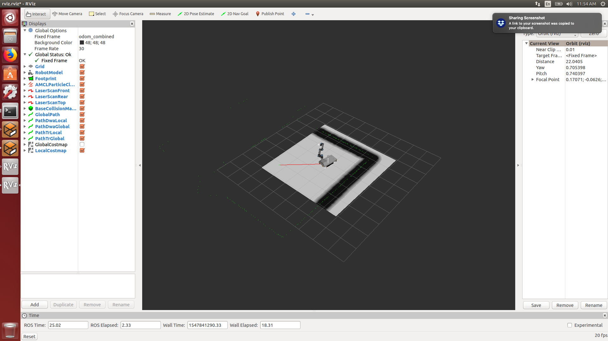
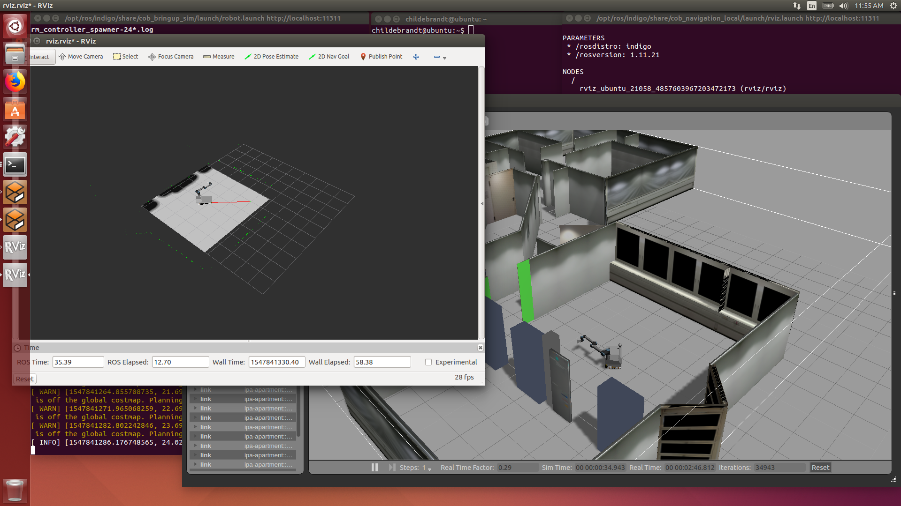

# Care-O-Bot

Care-O-Bot is a mobile robot assistant. While the current generation of Care-O-Bot, [Care-O-Bot 4](https://www.care-o-bot.de/en/care-o-bot-4.html) was created in 2015, the previous generation is from 1998. This generation, the [Care-O-Bot 3](https://www.care-o-bot.de/en/care-o-bot-3.html), needs a couple of tweaks to be used in 2019. 

The original instructions can be found on the [ROS
Wiki](https://wiki.ros.org/Robots/Care-O-bot/indigo). You will notice that this is the "Indigo" installation, yet the documentation says Hydro. Ignore that, we will keep working and hack it into Indigo.


## Prerequisites

* [Ubuntu 14.04.5 LTS (Trusty Tahr)](https://www.ubuntu.com/download/alternative-downloads)
* [ROS Indigo](https://wiki.ros.org/indigo/Installation/Ubuntu)

**Note:** Although ROS is technically available for MacOS I would not recommend that.

### Installing Ubuntu

The [Ubuntu 14.04.5 LTS (Trusty Tahr)](https://www.ubuntu.com/download/alternative-downloads) link will take you to a site which allows you to download [Ubuntu 14.04.5 LTS (Trusty Tahr)](https://www.ubuntu.com/download/alternative-downloads) ISO file. You can use this to flash your PC or install it on a virtual machine.

### Installing ROS

Please check the [ROS Indigo](https://wiki.ros.org/indigo/Installation/Ubuntu) for the latest installation guide however here are the basic commands.

Setup your sources.list
```
$ sudo sh -c 'echo "deb http://packages.ros.org/ros/ubuntu $(lsb_release -sc) main" > /etc/apt/sources.list.d/ros-latest.list'
```

Set up your keys
```
$ sudo apt-key adv --keyserver hkp://ha.pool.sks-keyservers.net:80 --recv-key 421C365BD9FF1F717815A3895523BAEEB01FA116
$ sudo apt-get update
```

Installation
```
$ sudo apt-get install ros-indigo-desktop-full
```

Initialize rosdep
```
$ sudo rosdep init
$ rosdep update
```

Environment Setup
```
$ echo "source /opt/ros/indigo/setup.bash" >> ~/.bashrc
$ source ~/.bashrc
```

## Installation

**The following instructions are modified from [here](https://wiki.ros.org/Robots/Care-O-bot/indigo).**

First make sure your system is up to date

```
$ sudo apt-get update
$ sudo apt-get upgrade
```

Setup your sources
```
$ sudo sh -c 'echo "deb http://packages.ros.org/ros/ubuntu $(lsb_release -sc) main" > /etc/apt/sources.list.d/ros-latest.list'
```

Set up your keys
```
$ sudo apt-key adv --keyserver hkp://ha.pool.sks-keyservers.net:80 --recv-key 421C365BD9FF1F717815A3895523BAEEB01FA116
$ sudo apt-get update
```

Install the Care-O-Bot ROS packages
```
$ sudo apt-get install ros-indigo-care-o-bot
```

Let the your terminal know where the packages are installed.
```
$ echo "source /opt/ros/indigo/setup.bash" >> ~/.bashrc
$ source ~/.bashrc
```

## Test the simulation

Try and launch the simulation using:
```
$ export ROBOT=raw3-3
$ export ROBOT_ENV=empty
$ roslaunch cob_bringup_sim robot.launch
```

Gazebo should open with a Robot in an open area as shown below:



**Note If you get the error:**
```
Warning [ModelDatabase.cc:334] Getting models from[http://gazebosim.org/models/]. This may take a few seconds.
Warning [gazebo.cc:215] Waited 1seconds for namespaces.
[0.000000] script_server is running
Warning [gazebo.cc:215] Waited 1seconds for namespaces.
Warning [gazebo.cc:215] Waited 1seconds for namespaces.
Warning [gazebo.cc:215] Waited 1seconds for namespaces.
...
```

This means that your Gazebo cant connect to the model database. Give it some time, and maybe try restarting it. However if it does not go away you can circumvent this by downloading the models yourself. Do using the solution found [here](https://answers.ros.org/question/199401/problem-with-indigo-and-gazebo-22/):
```
$ cd ~/.gazebo
$ mkdir models
```

Then download the models
```
$ cd ~/.gazebo/models
$ wget -r -R "index\.html*" http://models.gazebosim.org/
```

## Settings

The following settings can be changed:

Robot models can be set using:
```
$ export ROBOT=x
```

Where the available models can be seen using:

```
$ ls /opt/ros/indigo/share/cob_bringup/robots/
```

## Driving the Robot

You can drive the robot around using RViz as described below:

First set the robot and environment to your choice. Then launch the simulation:
```
$ export ROBOT=raw3-1
$ export ROBOT_ENV=ipa-apartment
$ roslaunch cob_bringup_sim robot.launch
```

Then launch the path finding node using in a new terminal:
```
$ roslaunch cob_navigation_local 2dnav_ros_dwa.launch robot:=cob4-3
```

Finally launch RViz node in a new terminal using:
```
$ roslaunch cob_navigation_local rviz.launch
```

Once you are able to see RViz select the 
2D Nav Goal tool, from the toolbar as shown below:


Click on the map and move the mouse in the direction of the orintation you want the robot to finish in as shown below:



Let go of the mouse and the robot will create a path to that goal and navigate itself towards it:



Finally you can watch the robot move in the simulation and in RViz:


