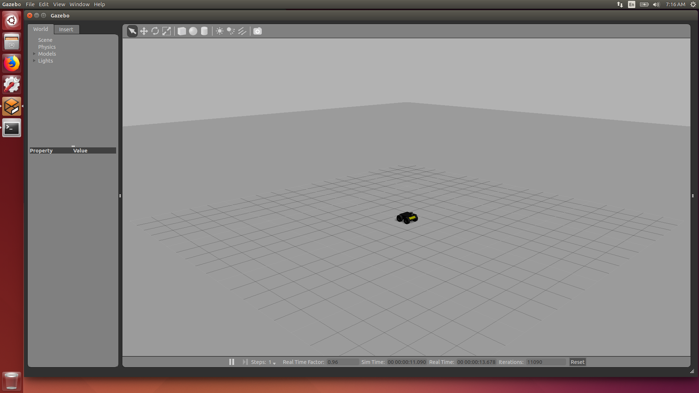
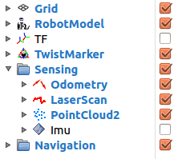

# Husky

[Husky](https://www.clearpathrobotics.com/husky-unmanned-ground-vehicle-robot/) is a medium sized research unmanned ground vehicle. It has a large array of payloads and sensor configurations. Husky is fully supported in [ROS](https://wiki.ros.org).

The original instructions are found at the [ROS Husky](https://wiki.ros.org/Robots/Husky) page. These notes are modified from the original instructions.

## Prerequisites

Husky supports ROS up to Melodic. This tutorial installs Husky on ROS Indigo.

* [Ubuntu 14.04.5 LTS (Trusty Tahr)](https://www.ubuntu.com/download/alternative-downloads)
* [ROS Indigo](https://wiki.ros.org/indigo/Installation/Ubuntu)

**Note:** Although ROS is technically available for MacOS I would not recommend that.

### Installing Ubuntu

The [Ubuntu 14.04.5 LTS (Trusty Tahr)](https://www.ubuntu.com/download/alternative-downloads) link will take you to a site which allows you to download [Ubuntu 14.04.5 LTS (Trusty Tahr)](https://www.ubuntu.com/download/alternative-downloads) ISO file. You can use this to flash your PC or install it on a virtual machine.

### Installing ROS

Please check the [ROS Indigo](https://wiki.ros.org/indigo/Installation/Ubuntu) for the latest installation guide however here are the basic commands.

Setup your sources.list
```
$ sudo sh -c 'echo "deb http://packages.ros.org/ros/ubuntu $(lsb_release -sc) main" > /etc/apt/sources.list.d/ros-latest.list'
```

Set up your keys
```
$ sudo apt-key adv --keyserver hkp://ha.pool.sks-keyservers.net:80 --recv-key 421C365BD9FF1F717815A3895523BAEEB01FA116
$ sudo apt-get update
```

Installation
```
$ sudo apt-get install ros-indigo-desktop-full
```

Initialize rosdep
```
$ sudo rosdep init
$ rosdep update
```

Environment Setup
```
$ echo "source /opt/ros/indigo/setup.bash" >> ~/.bashrc
$ source ~/.bashrc
```

## Installation

Install all the Husky Ros Packages using the following command:

```
$ sudo apt-get install 'ros-indigo-husky-*'
```

## Testing the Simulation

Set up the environment variables
```
$ export HUSKY_GAZEBO_DESCRIPTION=$(rospack find husky_gazebo)/urdf/description.gazebo.xacro
```

Run the simulation
```
$ roslaunch husky_gazebo husky_empty_world.launch
```

You should start with the husky on a flat surface as shown below:




**Note If you get the error:**
```
Warning [ModelDatabase.cc:334] Getting models from[http://gazebosim.org/models/]. This may take a few seconds.
Warning [gazebo.cc:215] Waited 1seconds for namespaces.
[0.000000] script_server is running
Warning [gazebo.cc:215] Waited 1seconds for namespaces.
Warning [gazebo.cc:215] Waited 1seconds for namespaces.
Warning [gazebo.cc:215] Waited 1seconds for namespaces.
...
```

This means that your Gazebo cant connect to the model database. Give it some time, and maybe try restarting it. However if it does not go away you can circumvent this by downloading the models yourself. Do using the solution found [here](https://answers.ros.org/question/199401/problem-with-indigo-and-gazebo-22/):
```
$ cd ~/.gazebo
$ mkdir models
```

Then download the models
```
$ cd ~/.gazebo/models
$ wget -r -R "index\.html*" http://models.gazebosim.org/
```

## Moving in the Simulation

Set up the environment variables
```
$ export HUSKY_GAZEBO_DESCRIPTION=$(rospack find husky_gazebo)/urdf/description.gazebo.xacro
```

Launch a more complex world using:
```
$ roslaunch husky_gazebo husky_playpen.launch
```

Start RViz which allows you to send inputs
```
$ roslaunch husky_viz view_robot.launch
```

Make sure you check the navigation check box as shown below:



Start the move_base demo
```
$ roslaunch husky_navigation move_base_mapless_demo.launch
```
